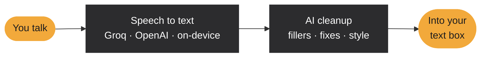

<p align="center">
  <picture>
    <source media="(prefers-color-scheme: dark)" srcset="docs/readme/hero-dark.png">
    
  </picture>
</p>

<p align="center">
  <a href="https://github.com/sidewinderzz/tokalot/releases/latest"></a>
</p>

<p align="center">
  
  <a href="LICENSE"></a>
  <a href="https://github.com/sidewinderzz/tokalot/releases"></a>
</p>

<br>

Open the keyboard in any app and a small button floats above it. Talk, and Tokalot types what you meant: filler words gone, self-corrections applied, formatted for the app you're in. It works with the keyboard you already use, and you bring your own API keys, so there's no subscription, account or Tokalot server.

<sub>Inspired by <a href="https://wisprflow.ai">Wispr Flow</a>, which is excellent and worth paying for if you want a polished product. Tokalot is an independent, open-source take for people who'd rather bring their own keys. Not affiliated with Wispr.</sub>

## How it works



If a provider is down or out of free quota, Tokalot tries another one you have a key for, then falls back to on-device speech recognition and basic cleanup. You always get your words.

## Features

<table>
  <tr>
    <td width="33%" valign="top">
      <b>Works with your keyboard</b><br>
      A floating button appears only while the keyboard is open. Drag it anywhere and it remembers the spot.
    </td>
    <td width="33%" valign="top">
      <b>Talk your way</b><br>
      Tap or hold to talk, auto-stop after 30&nbsp;s of silence, and it keeps recording even if the text box closes.
    </td>
    <td width="33%" valign="top">
      <b>Cleans up after you</b><br>
      Drops "um" and "uh", applies "no wait, I mean…" corrections, and keeps the slang you meant, like lol.
    </td>
  </tr>
  <tr>
    <td valign="top">
      <b>Styles per app</b><br>
      Messages, email, and AI &amp; code apps each get their own tone, from formal to very casual.
    </td>
    <td valign="top">
      <b>Your words, spelled right</b><br>
      A dictionary for names and jargon, plus snippets: say "my email" and get the full address.
    </td>
    <td valign="top">
      <b>Fast and cheap</b><br>
      Groq Whisper and GPT-OSS by default. Groq's free tier covers most people; heavy use costs cents.
    </td>
  </tr>
  <tr>
    <td valign="top">
      <b>History you can search</b><br>
      Every dictation with playback, the original transcript, one-tap copy, and Undo after inserting.
    </td>
    <td valign="top">
      <b>Private by design</b><br>
      Everything stays on your phone. Dictation goes only to the providers you pick, with your keys.
    </td>
    <td valign="top">
      <b>Yours to keep</b><br>
      One-file backup and restore, in-app updates, light and dark themes, and a usage and cost tracker.
    </td>
  </tr>
</table>

## Get started

1. **Install.** Download the APK from [Releases](https://github.com/sidewinderzz/tokalot/releases/latest) and open it on your phone.
2. **Add a key.** Get a free key at [console.groq.com/keys](https://console.groq.com/keys) and paste it in Tokalot's ☰ Settings.
3. **Allow the mic and turn on the accessibility switch.** The app explains exactly what that permission is used for before it takes you there.
4. **Talk.** Tap any text box, then tap the floating button.

> [!NOTE]
> Android and Play Protect show strong warnings for any app installed outside the Play Store that uses the accessibility permission, because that permission is powerful. That's expected. Everything Tokalot does is in this repo for you to read, and every release is built and signed by GitHub Actions from this code.

## What it costs

Tokalot is free. You pay your AI providers directly, at their rates:

| | Typical monthly cost for heavy use |
|---|---|
| Groq (default) | Free tier covers most people; paid is a few cents |
| Claude Haiku 4.5 for cleanup | About $0.60 |
| On-device only | $0, fully offline |

<sub>Estimates for roughly 40,000 spoken words over 7 weeks, from each provider's list prices. The app tracks your own usage and estimated cost under Settings › Usage.</sub>

## Privacy

- The accessibility permission is used only to notice when the keyboard is open on a text box, to know which app you're in, and to type your words. Tokalot doesn't read your screen, messages or notifications, and it skips password fields.
- History, recordings, settings and keys live only in the app's private storage on your phone. Backups leave out your API keys unless you choose to include them.
- Audio and text go only to the speech and cleanup services you picked, using your keys. With on-device speech recognition and cleanup turned off, nothing leaves your phone.

<details>
<summary><b>Building from source and releasing</b></summary>
<br>

Requirements: JDK 17, Android SDK 34, NDK 26.1.10909125, CMake 3.22.1. Then:

```sh
gradle assembleRelease
```

GitHub Actions builds and tests every push. To release, bump `versionCode` and `versionName` in `app/build.gradle.kts` and push to `main`. The workflow publishes a signed Release for that version, and installed copies offer it as an update.

Releases are signed with a key stored as repository secrets (`TOKALOT_KEYSTORE_BASE64`, `TOKALOT_KEYSTORE_PASSWORD`). It's never committed. Forks without those secrets still build, signed with a throwaway debug key.

</details>

## Credits

On-device speech recognition uses [whisper.cpp](https://github.com/ggml-org/whisper.cpp) (MIT). Headings use [EB Garamond](https://github.com/octaviopardo/EBGaramond12) (SIL Open Font License).

## License

[MIT](LICENSE). Use it, change it, share it. Contributions welcome.
