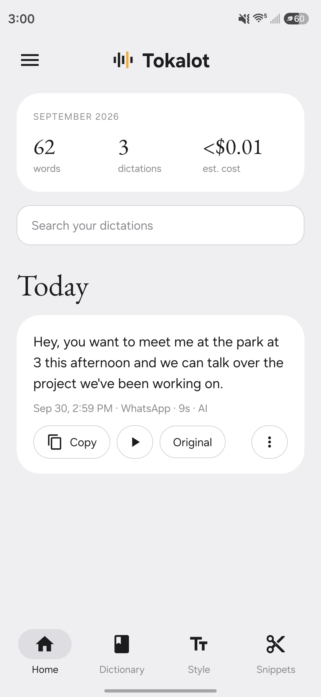
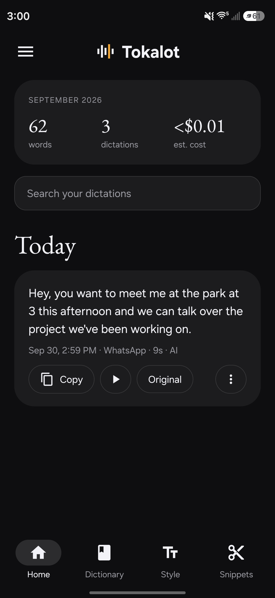

# Tokalot

Voice typing for Android that works with the keyboard you already use. Open the keyboard in any app and a small button floats above it. Talk, and your words are typed into the text box, cleaned up by AI: filler words removed, self-corrections applied, and formatted for the app you're in.

Bring your own API keys. There's no Tokalot server, account or subscription.

  
  

## What it does

- **Floating button** above the keyboard, only while the keyboard is open. Drag it anywhere; it remembers the spot.
- **Tap to talk or hold to talk.** Long-press or slide away to cancel. Optional auto-stop after 30 seconds of silence.
- **Keeps recording** if the text box or keyboard closes mid-sentence. The result is copied to the clipboard.
- **Speech-to-text:** Groq Whisper (fast, generous free tier), OpenAI, or fully offline on-device Whisper.
- **AI cleanup:** Groq, Claude Haiku, Gemini Flash-Lite or OpenAI. Falls back to another provider you have a key for, then to basic offline cleanup.
- **Per-app styles:** Messages, Email, AI & code, and everything else, each Formal / Casual / Very casual.
- **Dictionary** for names and jargon, and **snippets** (say a phrase, get a block of text exactly as written).
- **History** with search, playback of recordings, the original transcript, and Undo after inserting.
- **Usage and cost estimates** per month.
- **Backup / restore** to a single file. API keys are excluded unless you choose to include them.
- **In-app updates** from this repo's GitHub Releases.
- **Light and dark theme**, and your choice of color for the button while it's listening.

## Privacy

- The accessibility permission is used only to notice when the keyboard is open on a text box, to know which app you're in, and to type your words. Tokalot doesn't read your screen, messages or notifications, and skips password fields.
- History, recordings, settings and keys are stored only in the app's private storage on your phone.
- Your dictation leaves the phone only to go directly to the speech/cleanup services you picked, using your keys. With on-device speech-to-text and cleanup off, nothing leaves at all.

## Install

Download the latest APK from [Releases](../../releases) and open it on your phone. Android will warn about installing apps from outside the Play Store and about accessibility apps. That's expected for any sideloaded app of this kind. The source is all here if you want to check it.

In the app: open ☰ Settings, allow the microphone, paste a [Groq key](https://console.groq.com/keys), and turn on the accessibility switch.

## Build

GitHub Actions builds every push. To release, bump `versionCode` and `versionName` in `app/build.gradle.kts` and push to main: the workflow publishes a signed Release for that version, and installed copies offer it as an update.

Releases are signed with a private key stored as repository secrets (`TOKALOT_KEYSTORE_BASE64`, `TOKALOT_KEYSTORE_PASSWORD`). It is never committed. Forks without those secrets still build, signed with a throwaway debug key.

Local build: JDK 17, Android SDK 34, NDK 26.1.10909125, CMake 3.22.1, then `gradle assembleRelease`.

## Credits

On-device speech recognition uses [whisper.cpp](https://github.com/ggml-org/whisper.cpp) (MIT). Headings use EB Garamond (SIL Open Font License).
