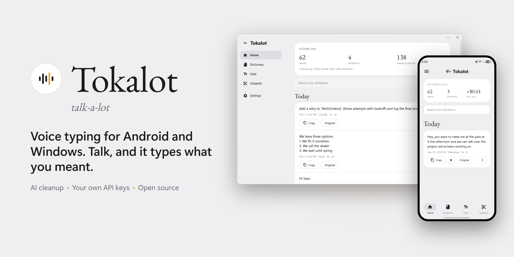
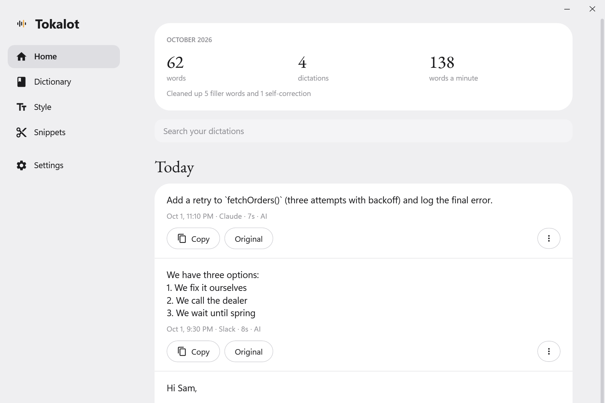

<p align="center">
  <picture>
    <source media="(prefers-color-scheme: dark)" srcset="docs/readme/hero-dark.png">
    
  </picture>
</p>

<p align="center">
  <a href="https://github.com/sidewinderzz/tokalot/releases/latest"></a>
  &nbsp;
  <a href="https://github.com/sidewinderzz/tokalot/releases/download/desktop/TokalotSetup.exe"></a>
</p>

<p align="center">
  
  
  <a href="LICENSE"></a>
  <a href="https://github.com/sidewinderzz/tokalot/releases"></a>
</p>

<br>

**Tokalot** *(talk-a-lot)* is voice typing for your phone and your PC. Talk, and Tokalot types what you meant: filler words gone, self-corrections applied, formatted for the app you're in. On Android a small button floats above the keyboard you already use. On Windows you hold **Ctrl+Win** in any app. You bring your own API keys, so there's no subscription, account or Tokalot server.

<sub>Inspired by <a href="https://wisprflow.ai">Wispr Flow</a>, which is excellent and worth paying for if you want a polished product. Tokalot is an independent, open-source take for people who'd rather bring their own keys. Not affiliated with Wispr.</sub>

## How it works

<p align="center">
  <picture>
    <source media="(prefers-color-scheme: dark)" srcset="docs/readme/flow-dark.png">
    
  </picture>
</p>

If a provider is down or out of free quota, Tokalot tries another one you have a key for, then falls back to on-device speech recognition and basic cleanup. You always get your words.

## Features

<table>
  <tr>
    <td width="33%" valign="top">
      <b>Works where you type</b><br>
      Android: a floating button over any keyboard, in any app. Windows: hold Ctrl+Win anywhere and the text is pasted at your cursor.
    </td>
    <td width="33%" valign="top">
      <b>Talk your way</b><br>
      Hold to talk or tap for hands-free. Auto-stop after 30&nbsp;s of silence, and Esc cancels on Windows.
    </td>
    <td width="33%" valign="top">
      <b>Cleans up after you</b><br>
      Drops "um" and "uh", applies "no wait, I mean…" corrections, and keeps the slang you meant, like lol.
    </td>
  </tr>
  <tr>
    <td valign="top">
      <b>Styles per app</b><br>
      Messages, email, and AI &amp; code apps each get their own tone, from formal to very casual.
    </td>
    <td valign="top">
      <b>Your words, spelled right</b><br>
      A dictionary for names and jargon, plus snippets: say "my email" and get the full address.
    </td>
    <td valign="top">
      <b>Fast and cheap</b><br>
      Groq Whisper and GPT-OSS by default. Groq's free tier covers most people; heavy use costs cents.
    </td>
  </tr>
  <tr>
    <td valign="top">
      <b>History you can search</b><br>
      Every dictation with playback, the original transcript and one-tap copy. A failed or cancelled recording is kept so you can transcribe it again.
    </td>
    <td valign="top">
      <b>Private by design</b><br>
      Everything stays on your device. Dictation goes only to the providers you pick, with your keys.
    </td>
    <td valign="top">
      <b>Yours to keep</b><br>
      One-file backup and restore, in-app updates, light and dark themes, a usage and cost tracker, and optional sync of your dictionary, snippets and styles between devices.
    </td>
  </tr>
</table>

## Get started

### Android

1. **Install.** Download the APK from [Releases](https://github.com/sidewinderzz/tokalot/releases/latest) and open it on your phone.
2. **Add a key.** Get a free key at [console.groq.com/keys](https://console.groq.com/keys) and paste it in Tokalot's ☰ Settings.
3. **Allow the mic and turn on the accessibility switch.** The app explains exactly what that permission is used for before it takes you there.
4. **Talk.** Tap any text box, then tap the floating button.

> [!NOTE]
> Android and Play Protect show strong warnings for any app installed outside the Play Store that uses the accessibility permission, because that permission is powerful. That's expected. Everything Tokalot does is in this repo for you to read, and every release is built and signed by GitHub Actions from this code.

### Windows

<p align="center">
  <picture>
    <source media="(prefers-color-scheme: dark)" srcset="docs/screenshots/desktop-home-dark.png">
    
  </picture>
</p>

1. **Install.** Download [TokalotSetup.exe](https://github.com/sidewinderzz/tokalot/releases/download/desktop/TokalotSetup.exe) and run it. Tokalot then lives in the tray and updates itself.
2. **Add a key.** Get a free key at [console.groq.com/keys](https://console.groq.com/keys) and paste it under Settings › API keys.
3. **Talk.** Click into any text box, hold **Ctrl+Win** while you talk, and let go. Tap Ctrl+Win once for hands-free and tap again to finish. Esc cancels.

> [!NOTE]
> Windows may show "Windows protected your PC" because the installer isn't code-signed yet. Click **More info → Run anyway**. Every release is built by GitHub Actions from this code.

### Linux (beta)

A port of the Windows app, for X11 and Wayland desktops on 64-bit Intel/AMD: hold **Ctrl+Super** and talk. Download the newest `Tokalot-linux-x64` build from [Releases](https://github.com/sidewinderzz/tokalot/releases) (tagged `linux-v…`, marked pre-release) and follow [linux/README.md](linux/README.md). It needs two one-time permissions, which the app shows you with a Copy button.

> [!WARNING]
> The Linux build has only been run under WSL so far, not on a real Linux desktop. Recording, pasting, the tray icon and the on-screen indicator may need fixes on your setup. If you try it, please open an issue with your distro, desktop and the output of `Tokalot --diagnose`.

### Mac (experimental)

A port of the Linux app for Macs with Apple silicon (M1 or newer) on macOS 15 or newer: hold **Ctrl+Cmd** and talk. Download the newest `Tokalot-mac-arm64` zip from [Releases](https://github.com/sidewinderzz/tokalot/releases) (tagged `mac-v…`, marked pre-release), move Tokalot.app to Applications and follow [mac/README.md](mac/README.md). The app isn't signed by Apple yet, so the first start needs **System Settings › Privacy & Security › Open Anyway**, and it asks for three permissions (Input Monitoring, Accessibility, Microphone), which the app shows you with a button to each.

> [!WARNING]
> The Mac build has only been run on GitHub's build machines, never by a person on a real Mac. The shortcut, the microphone, pasting, the permission prompts, the menu-bar icon and the recording indicator have not been tried by hand and may need fixes. If you try it, please comment on the ["Mac testers wanted" issue](https://github.com/sidewinderzz/tokalot/issues/6) with your Mac, macOS version and the output of `Tokalot --diagnose`.

## What it costs

Tokalot is free. You pay your AI providers directly, at their rates:

| | Typical monthly cost for heavy use |
|---|---|
| Groq (default) | Free tier covers most people; paid is a few cents |
| Claude Haiku 4.5 for cleanup | About $0.60 |
| On-device only | $0, fully offline |

<sub>Estimates for roughly 40,000 spoken words over 7 weeks, from each provider's list prices. The app tracks your own usage and estimated cost under Settings › Usage.</sub>

## Privacy

- **Android:** the accessibility permission is used only to notice when the keyboard is open on a text box, to know which app you're in, and to put your words into that text box. Tokalot doesn't read your messages or notifications, and it skips password fields.
- **Windows:** the Ctrl+Win listener only watches for that shortcut; it never records your typing. API keys are encrypted with your Windows account, and dictated text is kept out of Windows clipboard history.
- History, recordings, settings and keys live only on your device. Backups leave out your API keys unless you choose to include them.
- Audio and text go only to the speech and cleanup services you picked, using your keys. A cleanup request also carries the name of the app you're dictating into, your dictionary words and, on Android, whether the cursor is in the middle of a sentence (never the text around it), so the model can match the style, spelling and capitals. With on-device speech recognition and cleanup turned off, nothing you say leaves your device.
- Sync is optional and off by default. It works through one small file that you keep in a folder you already sync (Google Drive, OneDrive, Dropbox, Syncthing); there is no Tokalot account or server. History and recordings are never put in it, and API keys only if you turn that on.
- The apps check GitHub for new releases. There are no Tokalot servers, accounts or tracking.

<details>
<summary><b>Building from source and releasing</b></summary>
<br>

**Android** (`app/`). Requirements: JDK 17, Android SDK 34, NDK 26.1.10909125, CMake 3.22.1. Then:

```sh
gradle assembleRelease
```

To release, bump `versionCode` and `versionName` in `app/build.gradle.kts`, add a `## <version>` section at the top of [`app/src/main/assets/CHANGELOG.md`](app/src/main/assets/CHANGELOG.md) (a unit test checks it's there), and push to `main`. The workflow publishes a signed Release for that version with that section as its notes, and installed copies offer it as an update, with the changes under the banner's "What's new". Releases are signed with a key stored as repository secrets (`TOKALOT_KEYSTORE_BASE64`, `TOKALOT_KEYSTORE_PASSWORD`). It's never committed. Forks without those secrets still build, signed with a throwaway debug key.

**Windows** (`windows/Tokalot.Desktop`). Requirements: the .NET 10 SDK. Then:

```sh
dotnet publish windows/Tokalot.Desktop -c Release -r win-x64 --self-contained
```

To release, bump `<Version>` in `Tokalot.Desktop.csproj` and push to `main`. The workflow publishes `desktop-v<version>` and refreshes the rolling `desktop` release that the installer link and the in-app updater use. `Tokalot.exe --screenshots <folder>` renders every page with sample data, which is how the screenshots here are made.

**Linux** (`linux/Tokalot.Linux`, which also compiles the shared code in `windows/Tokalot.Desktop/Core`). Requirements: the .NET 10 SDK. Then:

```sh
dotnet publish linux/Tokalot.Linux -c Release -r linux-x64 --self-contained
```

To release, bump `<Version>` in `Tokalot.Linux.csproj` and push to `main`. The workflow publishes `linux-v<version>` as a pre-release.

**Mac** (`mac/Tokalot.Mac`, which also compiles the shared code in `windows/Tokalot.Desktop/Core` and the Linux app's interface). Requirements: the .NET 10 SDK, on a Mac. Then:

```sh
dotnet publish mac/Tokalot.Mac -c Release -r osx-arm64 --self-contained
```

To release, bump `<Version>` in `Tokalot.Mac.csproj` and push to `main`. The workflow assembles and checks `Tokalot.app` on a macOS build machine and publishes `mac-v<version>` as a pre-release.

GitHub Actions builds every push and runs the Android unit tests.

</details>

## Credits

On-device speech recognition uses [whisper.cpp](https://github.com/ggml-org/whisper.cpp) (MIT), through [Whisper.net](https://github.com/sandrohanea/whisper.net) on Windows, Linux and Mac. The Linux and Mac interface uses [Avalonia](https://github.com/AvaloniaUI/Avalonia). Audio on Windows uses [NAudio](https://github.com/naudio/NAudio), and installs and updates use [Velopack](https://github.com/velopack/velopack). Headings use [EB Garamond](https://github.com/octaviopardo/EBGaramond12) (SIL Open Font License).

## License

[MIT](LICENSE). Use it, change it, share it. Contributions welcome.
